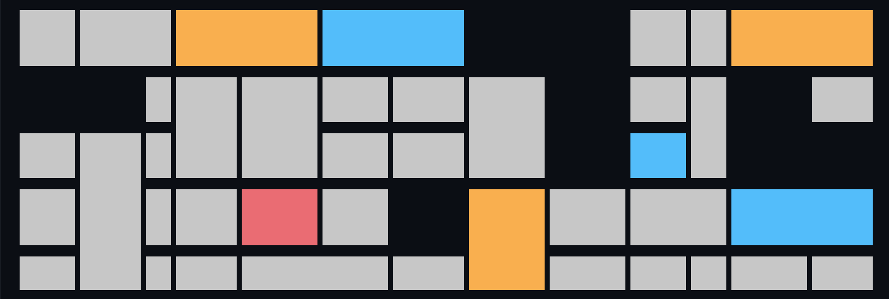

# Mondrian Style Painting Generator

Piet Mondrian was a 20th-century Netherlandish artist, the founder of Neoplasticism and one of the representatives of abstract painting. His iconic works often used bands of primary colors such as blue, yellow and red, as well as black and white. The artist created his works based on a minimalist approach, separating the bands of color with horizontal and vertical elements.

The program generates random paintings in Mondrian's style.

## How to Generate

1. Run the program in a compatible environment.
2. Watch as the program generates random paintings in the style of Piet Mondrian.
3. Experiment with different compositions and colors to create your own abstract masterpieces.

## Features

- Generate random paintings inspired by Piet Mondrian's iconic style.
- Explore abstract art through the use of primary colors and minimalist design.
- Create unique compositions with horizontal and vertical elements.

## Instructions

1. Open a terminal or command prompt.
2. Navigate to the program's directory.
3. Run the program using `python mondrian_painting_generator.py`.
4. Observe the generation of random paintings in Mondrian's style.
5. Experiment with different compositions by running the program multiple times.

## Sample Output

## Note

The Mondrian Style Painting Generator allows you to unleash your creativity and explore the abstract world of Neoplasticism. Create your own unique abstract compositions inspired by the legendary Piet Mondrian.

*Note: To learn more about Piet Mondrian's life and work, visit the Wikipedia article [here](https://en.wikipedia.org/wiki/Piet_Mondrian).*